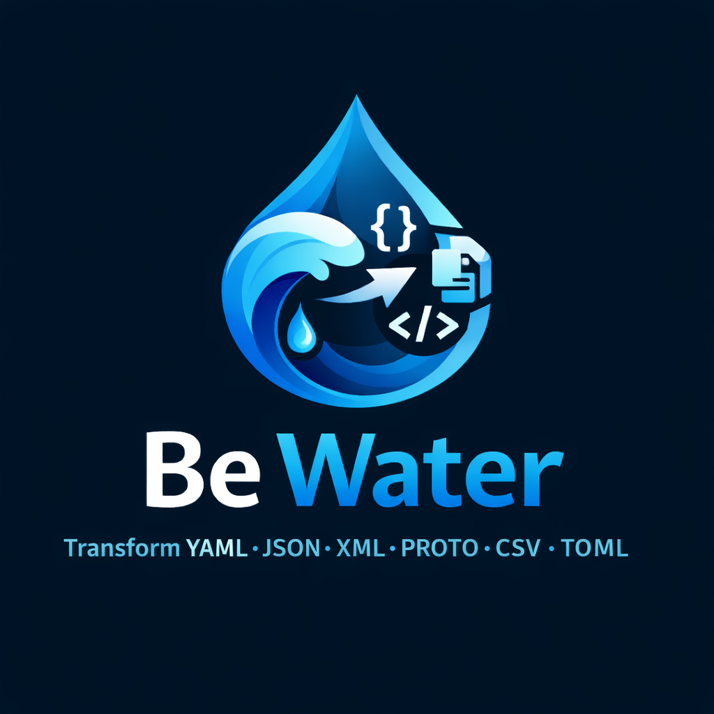

<div align="center">
  

  # Be Water Converter

  *Be water, my friend — let your data flow between formats.*

  An IntelliJ IDEA plugin that converts data between JSON, XML, YAML, CSV, TOML and
  Protobuf, and generates Java POJOs — all inside a syntax-highlighted tool window.

  [](https://openjdk.org/projects/jdk/21/)
  [](https://plugins.jetbrains.com/)
  [](LICENSE)
</div>

---

## Overview

Be Water Converter adds a tool window (anchored on the right) with a two-pane editor UI
for input and output, toolbar actions for convert, format, swap, copy, clear, open, and
save, and a context-sensitive options bar for conversion-specific settings. Inputs are
normalized through JSON as an internal pivot format, which keeps the individual converters
small and makes every cross-format conversion path consistent.

The UI is built around `RSyntaxTextArea` editors with dark-theme styling, input/output
format badges, and dynamic output-format constraints based on the selected source format.
The toolbar wraps responsively onto multiple rows when the tool window is narrow.

## Installation

1. In IntelliJ IDEA, go to **Settings → Plugins → Marketplace**.
2. Search for **Be Water Converter**.
3. Click **Install** and restart the IDE.

Or install from disk: download the ZIP from the
[releases page](https://github.com/nomikosi/be-water-converter/releases), then
**Settings → Plugins → ⚙ → Install Plugin from Disk…**.

Once installed, open the **Be Water** tool window from the right side bar, or via
**Tools → Be Water Converter**.

## Supported conversions

| Input | Supported outputs |
|---|---|
| JSON | XML, YAML, CSV, TOML, Protobuf, Java POJO |
| XML | JSON, YAML, CSV, TOML, Protobuf, Java POJO |
| YAML | JSON, XML, CSV, TOML, Protobuf, Java POJO |
| CSV | JSON, XML, YAML, TOML, Protobuf, Java POJO |
| TOML | JSON, XML, YAML, CSV, Protobuf, Java POJO |
| Protobuf | JSON, XML, YAML, CSV, TOML, Java POJO |

Most conversions follow a two-step flow: input is first normalized to JSON, then JSON is
rendered to the requested target format. JSON input additionally passes through a lenient
auto-close step that repairs unclosed `{` / `[` brackets before parsing.

## Features

### Interactive tool window

The plugin is registered through `ConverterToolWindowFactory`, which mounts a
`ConverterPanel` as tool-window content. The panel contains split editors, format
selectors, a swap button between the From/To selectors, status feedback, and one-click
actions for conversion, formatting, file open/save, and more. The output editor's syntax
mode and format badge update automatically after each successful conversion. Swap is
available when the current output format is also a supported input format; generated
Java POJO output is intentionally output-only.

### Keyboard shortcut

| Shortcut | Action |
|---|---|
| <kbd>Ctrl</kbd>+<kbd>Enter</kbd> | Convert input to selected output format |

This shortcut is active while focus is inside the Be Water tool window. Other actions are
available from the toolbar buttons.

### File import and export

**Open** loads a file into the input editor and auto-detects the source format from the
file extension (`.json`, `.xml`, `.yaml`/`.yml`, `.csv`, `.toml`, `.proto`). **Save**
writes the current output to disk using the appropriate format extension.

You can also **drag and drop** a file directly onto the input editor. The file is loaded
and the source format is auto-detected from the extension, just like the Open action.

### Format-aware formatting

The **Format** action pretty-prints or canonicalizes the current input for JSON, XML,
YAML, and TOML. JSON formatting also applies the lenient auto-close logic, which helps
recover truncated input during interactive editing.

### Conversion-specific options bar

When the selected output format has extra settings, a dedicated options bar appears below
the toolbar. CSV output shows a mode selector with a live hint; Java POJO output shows a
Lombok toggle. The bar hides itself when the current conversion has no extra settings.

### CSV export modes

CSV generation supports two expansion modes:

- **`FLAT_FIRST`** — expands only the first array-of-objects into rows; later object
  arrays are serialized into a single JSON string cell. Nested objects are flattened with
  dot notation and primitive arrays are joined into comma-separated cells. This is the
  safe default for nested documents.
- **`CROSS_JOIN`** — performs a full Cartesian product across all object arrays, so
  arrays of sizes s1 × s2 × … × sN produce that many rows. Useful for fully denormalized
  tabular exports, but row counts can explode; conversions estimated to exceed the
  configurable **row warning threshold** (default 1,000) ask for confirmation first. The
  threshold can be adjusted via the **Row warning** spinner that appears in the options
  bar when `CROSS_JOIN` mode is selected.

#### `FLAT_FIRST` example

```json
{
  "customer": "Alice",
  "orders": [
    {"id": "O1", "amount": 100},
    {"id": "O2", "amount": 150}
  ],
  "tags": [
    {"name": "vip"},
    {"name": "priority"}
  ]
}
```

```csv
customer,orders.id,orders.amount,tags
Alice,O1,100,"[{\"name\":\"vip\"},{\"name\":\"priority\"}]"
Alice,O2,150,"[{\"name\":\"vip\"},{\"name\":\"priority\"}]"
```

#### `CROSS_JOIN` example

```json
{
  "env": "prod",
  "databases": [{"host": "db1"}, {"host": "db2"}],
  "tenants": [{"name": "alpha"}, {"name": "beta"}]
}
```

```csv
env,databases.host,tenants.name
prod,db1,alpha
prod,db1,beta
prod,db2,alpha
prod,db2,beta
```

### Java POJO generation

Java POJO output is generated from JSON structure and emits field-only class skeletons,
including `@JsonProperty` annotations where the source key differs from the generated
camelCase field name. Arrays of objects become `List<...>` fields, nested objects become
nested class types, and numbers are mapped to `Integer`, `Long`, `Float`, `Double`, or
`BigDecimal` as appropriate. The optional **Lombok annotations** mode annotates every
generated class with `@Data`, `@NoArgsConstructor`, and `@AllArgsConstructor`.

### Protobuf schema generation

The Protobuf converter works structurally in both directions without invoking `protoc`:

- **`protoToJson`** parses proto3-style schemas using brace-depth tracking, so nested
  `message` definitions, `oneof` blocks, and `enum` blocks are handled correctly.
  Fields whose type matches a known message name are resolved to nested JSON objects
  with that message's default structure, rather than producing empty placeholders.
  `oneof` fields are included alongside regular fields with their typed defaults.
- **`jsonToProto`** walks a JSON tree and emits a proto3 schema with inline nested
  messages and repeated fields.

Malformed Protobuf input fails with targeted validation messages (unbalanced braces,
malformed field statements, duplicate field numbers) instead of being silently skipped.

#### Nested message example

```protobuf
message Outer {
  string name = 1;
  message Inner {
    int32 value = 1;
  }
  Inner inner = 2;
}
```

Produces:

```json
{
  "Outer": {
    "name": "",
    "inner": { "value": 0 }
  }
}
```

#### Oneof example

```protobuf
message Payment {
  string currency = 1;
  oneof payment_method {
    string card_number = 2;
    string bank_account = 3;
  }
}
```

Produces:

```json
{
  "Payment": {
    "currency": "",
    "card_number": "",
    "bank_account": ""
  }
}
```

## Architecture

| Class | Responsibility |
|---|---|
| `ConverterToolWindowFactory` | Registers and mounts the tool-window content. |
| `ConverterPanel` | UI, toolbar actions, conversion dispatch, formatting, file I/O, status updates. |
| `OpenConverterAction` | Menu action (**Tools → Be Water Converter**) that activates the tool window. |
| `WrapLayout` | Responsive multi-row wrapping for the toolbar and options bar. |
| `JsonXmlConverter` | JSON ↔ XML conversion. |
| `JsonYamlConverter` | JSON ↔ YAML conversion. |
| `CsvConverter` | CSV ↔ JSON conversion and CSV flattening logic. |
| `TomlConverter` | TOML ↔ JSON conversion. |
| `ProtoConverter` | Protobuf schema ↔ JSON structural conversion. |
| `JavaPojoGenerator` | Java class generation from structured JSON. |

## Development

### Requirements

- Java 21
- IntelliJ Platform Gradle Plugin 2.x (targets IntelliJ IDEA Community 2024.3)

### Running locally

1. Open the project in IntelliJ IDEA.
2. Run the Gradle `runIde` task to launch a sandbox IDE.
3. Open the **Be Water** tool window on the right side of the sandbox IDE.
4. Paste sample input, choose source and destination formats, and convert.

### Testing

Run pure JVM unit tests (no IDE sandbox required) with:

```bash
gradle unitTest
```

The `check` task runs them automatically. The test suite covers all converter classes with
~340 test cases, including CSV flattening edge cases (empty arrays, nulls, missing fields,
header ordering), Protobuf validation, POJO generation variants, and end-to-end cross-format
pipeline tests.

### Building a distribution

```bash
gradle buildPlugin
```

The installable ZIP is produced in `build/distributions/`. To validate compatibility
against a range of IDE builds before publishing, run `gradle verifyPlugin`.

## Compatibility

| Property | Value |
|---|---|
| Plugin version | 1.3.1 |
| Minimum IDE build | 243 (IntelliJ IDEA 2024.3) |
| Maximum IDE build | Open-ended |
| Java | 21 |

## Limitations

- Converters are structural rather than semantic: generated Protobuf and Java output is a
  starting point, not a finalized contract or domain model.
- JSON auto-close is intentionally lenient and may repair malformed JSON into a parseable
  shape that differs from the original intent.
- `CROSS_JOIN` CSV exports can grow very quickly with multiple nested arrays; prefer
  `FLAT_FIRST` for general use.

## Roadmap ideas

- Remember option selections (CSV mode, Lombok toggle, row threshold) across IDE restarts.
- Conversion history or undo support.
- Conversion cancel button for long-running operations.

## License

[Apache License 2.0](LICENSE) — Copyright 2026 Nomikosi Consulting.
