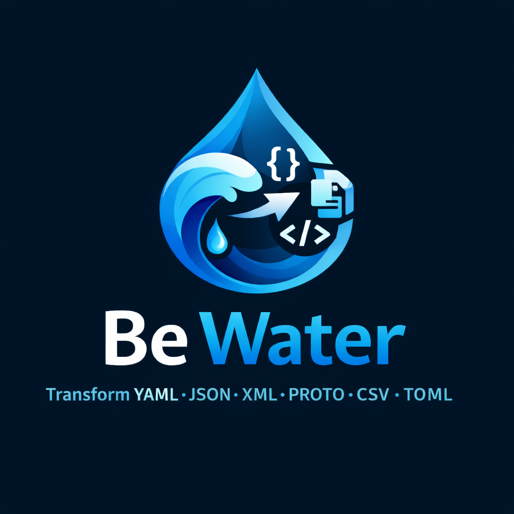

<div align="center">
  

  # Be Water Converter

  *Be water, my friend — let your data flow between formats.*

  An IntelliJ IDEA plugin that converts data between JSON, XML, YAML, CSV, TOML and
  Protobuf, and generates Java POJOs, Kotlin data classes and JSON Schema — all inside a
  syntax-highlighted tool window.

  [](https://github.com/nomikosi/be-water-converter/actions/workflows/build.yml)
  [](https://plugins.jetbrains.com/plugin/32279-be-water-converter)
  [](https://openjdk.org/projects/jdk/21/)
  [](https://plugins.jetbrains.com/plugin/32279-be-water-converter)
  [](LICENSE)
</div>

---

## Overview

Be Water Converter adds a tool window (anchored on the right) with a two-pane editor UI
for input and output, toolbar actions for convert, format, swap, copy, clear, open, and
save, and a context-sensitive options bar for conversion-specific settings. Inputs are
normalized through JSON as an internal pivot format, which keeps the individual converters
small and makes every cross-format conversion path consistent.

The UI is built around `RSyntaxTextArea` editors with dark-theme styling, input/output
format badges, and dynamic output-format constraints based on the selected source format.
The toolbar wraps responsively onto multiple rows when the tool window is narrow.

## Installation

1. In IntelliJ IDEA, go to **Settings → Plugins → Marketplace**.
2. Search for **Be Water Converter**.
3. Click **Install** and restart the IDE.

Or install from disk: download the ZIP of a version from the plugin's
[Marketplace page](https://plugins.jetbrains.com/plugin/32279-be-water-converter/versions), then
**Settings → Plugins → ⚙ → Install Plugin from Disk…**.

Once installed, open the **Be Water** tool window from the right side bar, or via
**Tools → Be Water Converter**.

## Supported conversions

| Input | Supported outputs |
|---|---|
| JSON | XML, YAML, CSV, TOML, Protobuf, Java POJO, Kotlin, JSON Schema |
| XML | JSON, YAML, CSV, TOML, Protobuf, Java POJO, Kotlin, JSON Schema |
| YAML | JSON, XML, CSV, TOML, Protobuf, Java POJO, Kotlin, JSON Schema |
| CSV | JSON, XML, YAML, TOML, Protobuf, Java POJO, Kotlin, JSON Schema |
| TOML | JSON, XML, YAML, CSV, Protobuf, Java POJO, Kotlin, JSON Schema |
| Protobuf | JSON, XML, YAML, CSV, TOML, Java POJO, Kotlin, JSON Schema |

`Java POJO`, `Kotlin` and `JSON Schema` are output-only: none is accepted as an input
format, so **Swap** refuses to move them to the input side.

Most conversions follow a two-step flow: input is first normalized to JSON, then JSON is
rendered to the requested target format. JSON input is parsed leniently — comments, trailing
commas, single quotes, and unquoted field names are accepted — and additionally passes
through an auto-close step that repairs unclosed `{` / `[` brackets and unterminated strings
before parsing. Multi-document YAML (`---`-separated, e.g. Kubernetes manifests) converts to
a JSON array with one element per document.

YAML is read by the 1.2 core schema, plus the binary (`0b101`) and underscore (`1_000`)
integers most YAML 1.1 tools also read: `yes`, `no`, `on` and `off` are text (so a GitHub
Actions `on:` key stays `on`), `12:30:00` and `0777` are text, `0o17` is the octal number
15, floats keep the digits they were written with, and anchors and merge keys are expanded
in place. A document may nest 500 levels deep. A document whose aliases would expand to more
than two million values, or whose anchors form a cycle, is refused rather than converted.
YAML output quotes a string that a YAML 1.1 reader such as PyYAML or docker-compose would
take for a number or a date (`22:22`, `2024-01-01`), as it quotes `yes` and `no`. It also
quotes a string holding a NEL (U+0085), which YAML 1.1 reads as a line break, and one
opening the document with U+FEFF, which a reader drops as a byte-order mark; half of a
surrogate pair, which is no character, is refused.

JSON keys that are not valid XML element names or Protobuf identifiers (spaces, kebab-case,
leading digits, or characters such as `µ` that XML names cannot hold) are sanitized when
rendering to those formats, so the output is always well-formed. A key that is already a
valid name keeps it, and a renamed key that would take a name in use is numbered:
`{"first name": "Ann", "first_name": "Bob"}` gives `<first_name>Bob</first_name>` and
`<first_name_2>Ann</first_name_2>`. JSON `null` becomes an XML element marked
`xsi:nil="true"`, which reads back as `null` rather than as an empty string. Every output
uses LF line breaks.

## Features

### Interactive tool window

The plugin is registered through `ConverterToolWindowFactory`, which mounts a
`ConverterPanel` as tool-window content. The panel contains split editors, format selectors,
a swap button between the From/To selectors, status feedback, and one-click actions for
conversion, formatting, file open/save, and more. The output editor's syntax mode and format
badge update automatically after each successful conversion. Conversions run in the
background and can be cancelled — the Convert button turns into **Cancel** while one is
running. A syntax error is one line in the status bar, ending with the line and column the
caret moves to; longer messages, such as Protobuf validation errors with an example, also
open an IDE notification balloon, and the status bar shows their first line. Very large
outputs are rendered with syntax highlighting disabled to keep the editor responsive.

A **history** toolbar button lists the last 20 successful conversions of the session
(time, formats, output size); selecting an entry restores both editors, format
selections, and the conversion options (including the delimiter and subtree filter)
used for that result. Conversions over ~1 MB of combined text are not recorded, so history never
holds large payloads in memory. Swap is
available when the current output format is also a supported input format; generated
Java POJO output is intentionally output-only.

### Keyboard shortcuts

| Shortcut | Action |
|---|---|
| <kbd>Ctrl</kbd>+<kbd>Enter</kbd> | Convert input to selected output format |
| <kbd>Ctrl</kbd>+<kbd>Shift</kbd>+<kbd>S</kbd> | Save the output to a file |
| <kbd>Ctrl</kbd>+<kbd>F</kbd> | Find in the focused editor (Enter = next, Shift+Enter = previous, Esc = close) |

These shortcuts are active while focus is inside the Be Water tool window. Other actions are
available from the toolbar buttons. The main operations (Convert, Format Input, Copy Output,
Open File, Save Output) are also registered as IDE actions, so you can find them via **Find
Action** and assign your own shortcuts in **Settings → Keymap** (search for "Be Water").

The panel binds no other keys, because the IDE's keymap sees a keystroke first: bindings of
its own for Alt+Shift+L, Alt+Shift+C and Ctrl+Shift+O never ran, since the IDE's Load
Context, Recent Changes and Load Gradle Changes took them. In the editors, Ctrl+D (Cmd+D on
macOS) does nothing rather than delete the line, as the embedded editor would: everywhere
else in the IDE the key duplicates the line, and that action works only in the IDE's own
editors.

### File import and export

**Open** loads a file into the input editor and auto-detects the source format from the file
extension (`.json`, `.xml`, `.yaml`/`.yml`, `.csv`/`.tsv`, `.toml`, `.proto`). If the file
is open in an editor with unsaved changes, the editor's text is loaded rather than the stale
copy on disk. A file is decoded by its byte-order mark, then in the encoding the IDE has for
it (**Settings → Editor → File Encodings**, or `.editorconfig`), then as UTF-8, then as
Windows-1252, and the status bar names the encoding when it was not UTF-8. **Save** writes
the current output to disk using the appropriate format extension and refreshes the file in
the IDE's virtual file system, so a file saved into the project shows up straight away.

File loads discard stale results if the input changes or a newer file is opened before
completion. Saves use a unique temporary file in the destination directory before replacing
the target, so overlapping saves do not share temporary files. On Linux and macOS the saved
file keeps the permissions of the file it replaces, and saving to a symbolic link writes the
file the link points to rather than replacing the link. On Windows, a save retries for a
moment when another program, such as a virus scanner, holds the file.

A save keeps the style of the file it replaces: its CRLF or LF line breaks (leaving those
inside quoted CSV cells as written) and, for CSV, Java and Kotlin, its encoding and
byte-order mark, so Excel still reads a Windows-1252 or "CSV UTF-8" file correctly after a
save. JSON, XML, YAML, TOML and Protobuf are written as UTF-8, the encoding their tools
read, and so is text that the file's encoding cannot hold, which the status bar then says. A
new file is UTF-8, with the project's line separator (**Settings → Editor → Code Style →
Line separator**).

You can also **drag and drop** a file directly onto the input editor. The file is loaded
and the source format is auto-detected from the extension, just like the Open action.

### Format-aware formatting

The **Format** action pretty-prints or canonicalizes the current input for JSON, XML, YAML,
TOML and CSV, and removes trailing blanks and extra blank lines from Protobuf. JSON
formatting also applies the lenient auto-close logic, which helps recover truncated input
during interactive editing. Format keeps the document's line breaks: a CRLF document stays
CRLF, and line breaks inside quoted CSV cells, which are data, stay as written.

Format is a layout action and is held to that. CSV is rewritten row by row without ever
being parsed into objects, so headers, ragged rows and cell text come back exactly as
written, including leading spaces, trailing empty tab-separated cells and rows whose only
cell is empty. YAML keeps one document per document, explicit null values, and the newlines
inside block scalars. Numbers keep the digits they were written with. JSON Format writes
every number exactly as the document spelled it (`1.10`, `1.5e1`, `-0.0`, `1e400`); YAML and
TOML keep `1.10` too, and refuse a number their JSON step would spell differently, as
described below. If the input is edited while Format is still running, the result is
discarded rather than written over the newer text. Delayed formatting errors and
cancellation are also discarded; Compare discards its result when either editor changes.

XML is re-indented only where an element holds nothing but other elements. Everything else
is written exactly as it was — text mixed with elements, `xml:space="preserve"` elements,
CDATA sections, entity references in text such as `&nbsp;`, whitespace that is an element's
whole value (`<sep> </sep>`), and elements holding only a comment — so the formatted
document converts exactly as the original did. Only XML's own whitespace counts as
indentation, so text of other Unicode spaces between elements is kept, and an XML 1.1
document keeps its control characters, NEL and line separator as character references:
written literally, they are ill-formed or read back as line feeds. The declaration keeps its
version and `standalone`, with `encoding="UTF-8"` since the editor holds text rather than
bytes; a document without a declaration gets none; and each comment or processing
instruction before the root keeps its own line. In XHTML, told by an XHTML DOCTYPE or by the
namespace of the root element as XHTML5 and EPUB 3 write it, only HTML's void elements are
written minimized (`<br />`); any other empty element keeps its end tag
(`<script src="a.js"></script>`), which an HTML parser needs.

Where a re-layout could only be done by changing what the document says, Format refuses and
leaves the editor alone: TOML dates, hex/octal/binary and underscore-separated numbers and
`inf`/`nan` (the JSON step in between cannot spell them); YAML `.inf`/`.nan`, non-string
mapping keys, timestamps and other tags the JSON step cannot preserve; in YAML and TOML, any
number that step would write back differently, such as `1.5e1` as `15` or YAML's `0x1F` as
`31`, with the message saying what it would become; XML nested more than 1,000 levels deep,
as conversion refuses it; and an XML entity from an external DTD inside an attribute value
(`title="&copy; 2024"`), which the parser drops there while it keeps one in text. Formats
that pass through the JSON tree keep only the data, so before YAML, TOML or
JSON-with-comments is rewritten, Format says how many comments (and YAML anchors) would be
dropped and asks first.

### Conversion-specific options bar

An options bar sits below the toolbar. **Sort keys** applies to every conversion and is
always shown; the format-specific groups appear only when they are relevant. CSV output
shows a mode selector with a live hint; CSV on either side shows a **Delimiter** selector;
CSV or XML input shows an **Infer types** toggle; Java POJO output shows Lombok and date
toggles. The row-warning threshold applies to both CSV modes. All option values (CSV mode,
delimiter, row-warning threshold, Lombok, type inference, date detection, sort keys, split
orientation) are persisted across IDE restarts. Each open project has its own panel, and an
option changed in one shows in the others at once; the split orientation and soft wrap stay
each panel's own.

### CSV delimiter

Comma, semicolon, and tab are supported for both reading and writing. Semicolon-separated
CSV is the norm across much of Europe, where the comma is the decimal separator; before this
option such a file parsed as a single column. The delimiter applies to whichever side of the
conversion is CSV. A `.tsv` file whose content does not show its delimiter is read with
tabs.

### Automatic format detection

Pasting or dropping content into the input editor sets the input format automatically:
JSON, XML, YAML, TOML, Protobuf, and CSV are recognized from the content itself. A leading
`[` is genuinely ambiguous — it opens both a JSON array and a TOML `[table]` header — so
detection looks for a following `key = value` line before deciding. Detection only ever
fires on a paste-sized insertion, never on typing, and stays silent when it cannot tell,
so it will not fight a format you selected yourself.

Detection checks JSON and XML first, then CSV, then the formats that can only be told line
by line, TOML and YAML, so a CSV whose cells hold `Re:` stays CSV. A Protobuf file is
recognised by `syntax`, `edition`, `message` or `enum` at the start of a line, so YAML that
carries a `.proto` in a block scalar stays YAML, and a TOML table header may be followed by
a comment.

For CSV the delimiter is detected as well — comma, semicolon or tab, whichever splits the
header and the first rows into the most columns alike, reading a quoted cell that spans
lines as one cell, so a tab-separated file whose values contain commas stays tab-separated —
and the **Delimiter** option is switched to match, both on paste and when a `.csv` or `.tsv`
file is opened. Context-menu conversions sniff the delimiter the same way, so a semicolon
file is never read as one wide column because the option still said comma.

### Sort keys

**Sort keys** orders object keys alphabetically throughout the document, leaving array
order untouched. Two documents carrying the same data in different key orders canonicalize
to the same output, which makes conversions diffable across runs and across sources. It is
applied to the internal JSON pivot, so every *conversion* target inherits the ordering.

The **Format** action sorts JSON, YAML and TOML, each of which already passes through the
JSON tree, and leaves XML and CSV in document order rather than round-tripping them through
JSON to reorder them.

### Using it from the editor and Project view

Right-click a file in the Project view, or a selection in any editor:

- **Open in Be Water Converter** loads the selection, the editor's contents, or the file into
  the tool window, with the format resolved from the extension where there is one and from
  the content otherwise.
- **Convert with Be Water → <format>** converts straight to the chosen format and opens the
  result as a scratch file, so it lands in a real IDE editor rather than the plugin's pane.

The entries appear on files of the formats the plugin reads — by the IDE's file type or by
extension, `.tsv`, SVG and XHTML included — on plain-text and unknown files whose start
reads as one of them, and on a selection in any file that does. Files in other languages
(Java, Python, shell scripts, Markdown, `.properties`) get them only for such a selection:
nearly all of them hold a line that looks like TOML's `key = value` or YAML's `key: value`.
The menu reads at most the first 4,096 characters of a selection, so it opens at once, and a
conversion tells the format from the first 64 KB.

Files are read and converted on a background task with a cancellable progress indicator, so
a large file never blocks the UI, and Cancel stops the conversion itself, not only the read.
A file that is not open in an editor is decoded as **Open** decodes it.

### Subtree filter

The **Filter** box converts only part of a document. Paths are
[RFC 6901](https://datatracker.ietf.org/doc/html/rfc6901) JSON Pointers, with a dotted
convenience syntax on top — `/users/0/name` and `users[0].name` select the same node, and a
leading `$`, `$.` or `$[` (as JSONPath spells the root) is accepted so paths copied from other
tools work. A key that only begins with `$`, such as `$id` or `$defs`, is read as a key.
Bracket-quoting reaches keys that contain dots or slashes: `['odd.key'].a`. A path that
matches nothing is reported as an error rather than silently converting an empty document.
This is deliberately selection only, not a query language, and adds no dependency.

### Open in editor

The output pane is a lightweight embedded editor, not an IDE editor. The **Open in editor**
toolbar button writes the current output to a scratch file and opens it, which gives you the
IDE's own highlighting, folding, keymap and Save As without leaving the workflow. Context-menu
conversions (*Convert with Be Water*) already land there directly.

### Compare

The **Compare** toolbar button opens the IDE's diff viewer on the two editors. Each side is
first normalised to canonical JSON — converted to the pivot format and key-sorted — so two
documents carrying the same data in different formats or different key orders compare as
identical, and only genuine differences appear. The status bar says so explicitly when the
two sides are equivalent. Numeric spellings such as `1`, `1.0`, and `1e0` compare
by exact value, and the diff writes whole numbers out (`12000`, not `1.2E+4`) up to 64
digits; Format and conversion still preserve decimal scale.

### CSV / XML type inference

When CSV or XML is the input format, values that look like integers, decimals, booleans,
or `null` are converted into typed JSON values by default, so `age,30` (or
`<age>30</age>`) becomes `"age": 30` instead of `"age": "30"`. Values with leading zeros
(`007`, `01234`) and integers too large for 64 bits stay strings, so identifiers are
never mangled. Exponent notation is read as a number only with a single digit or a decimal
point before the `e` (`1e3`, `1.5e3`); other digit runs with an `e` in them, such as the
short git hash `1234e56`, stay strings. Disable the **Infer types** checkbox to keep every
value a string.

### CSV export modes

CSV generation supports two expansion modes:

- **`FLAT_FIRST`** — expands only the first container array into rows (every element of
  that array becomes a row: objects are flattened, primitives and nested arrays become
  single-cell rows); later object arrays are serialized into a single JSON string cell.
  Nested objects are flattened with dot notation and primitive arrays are joined into
  comma-separated cells. This is the safe default for nested documents.
- **`CROSS_JOIN`** — performs a full Cartesian product across all object arrays, so
  arrays of sizes s1 × s2 × … × sN produce that many rows. Useful for fully denormalized
  tabular exports, but row counts can explode; conversions estimated to exceed the
  configurable **row warning threshold** (default 1,000) ask for confirmation first. The
  threshold can be adjusted via the **Row warning** spinner in the options bar, which is
  shown for both CSV modes since the warning applies to both.

#### `FLAT_FIRST` example

```json
{
  "customer": "Alice",
  "orders": [
    {"id": "O1", "amount": 100},
    {"id": "O2", "amount": 150}
  ],
  "tags": [
    {"name": "vip"},
    {"name": "priority"}
  ]
}
```

```csv
customer,orders.id,orders.amount,tags
Alice,O1,100,"[{""name"":""vip""},{""name"":""priority""}]"
Alice,O2,150,"[{""name"":""vip""},{""name"":""priority""}]"
```

#### `CROSS_JOIN` example

```json
{
  "env": "prod",
  "databases": [{"host": "db1"}, {"host": "db2"}],
  "tenants": [{"name": "alpha"}, {"name": "beta"}]
}
```

```csv
env,databases.host,tenants.name
prod,db1,alpha
prod,db1,beta
prod,db2,alpha
prod,db2,beta
```

### Java POJO generation

Java POJO output is generated from JSON structure and emits field-only class skeletons,
including `@JsonProperty` annotations where the source key differs from the generated
camelCase field name. Arrays of objects become `List<...>` fields, nested objects become
nested class types, and numbers are mapped to `Integer`, `Long`, `BigInteger`, `Double`, or
`BigDecimal` as appropriate. Decimal samples that cannot retain their value through a
`Double` use `BigDecimal`, including extreme exponents and high-precision values. An empty
object becomes a `Map<String, Object>`, which holds whatever the real data has there, where
an empty class would fail on it; an empty root object becomes a class marked
`@JsonIgnoreProperties(ignoreUnknown = true)`, which Jackson can write. String values in
ISO-8601 form are typed as `LocalDate`, `LocalDateTime`, or `OffsetDateTime` (validated with
a real `java.time` parse, so `2025-13-99` stays a `String`); disable this via the **Detect
dates** toggle. Jackson binds `java.time` fields only with the `jackson-datatype-jsr310`
module registered (`JavaTimeModule`, which Spring Boot registers), so turn the toggle off
for plain `jackson-databind`. Imports are emitted only when actually used. The optional
**Lombok annotations** mode annotates every generated class with `@Data`,
`@NoArgsConstructor`, and `@AllArgsConstructor`. The all-args annotation is omitted for
empty classes and for classes with more than 254 fields, where it would produce an invalid
JVM constructor. Past 500 fields a class also gets
`@ToString(onlyExplicitlyIncluded = true)`, since javac overflows its stack on a longer
`toString`, and past 1,000 it gets `@Getter` and `@Setter` instead of `@Data`, whose
`equals` exceeds the JVM's 64 KB limit on a method.

All classes are emitted into a single block that pastes into one `.java` file, so only
the root class is declared `public` — Java permits at most one public top-level type per
file. Two nested objects that would claim the same class name each get their own class
(`User`, `User2`) rather than sharing the first one's fields. Class names are unique ignoring
case, too: objects under `url` and `URL` become `Url` and `URL2`, because Windows and macOS
file systems cannot hold `Url.class` and `URL.class` side by side.

In Lombok mode, a field whose second letter is upper case (`xAxis`, `eTag`) gets a getter
that Jackson reads as another property (`getXAxis` as `xaxis`), so the class could not read
the JSON it was generated from. A class holding such a field binds through its fields
instead: it carries `@JsonAutoDetect` with field visibility, and every other class is left
as it was. Generated identifiers never contain `$`, which Lombok skips: `$ref` becomes
`_ref`, mapped back with `@JsonProperty`.

Arrays are typed from every element, not just the first: objects in an array contribute the
union of their keys to one class, numbers widen to the widest kind seen (`[1, 2.5]` is a
`List<Double>`), two dates of the same kind stay that kind, and elements of genuinely
different kinds fall back to `List<Object>`. The test suite compiles the generated Java
with `javac` rather than only checking for substrings, and reads every sample through the
compiled Lombok classes and writes it back unchanged.

### JSON Schema generation

`JSON Schema` output infers a [draft 2020-12](https://json-schema.org/draft/2020-12/schema)
schema from the input document. Every key that appears in the example is listed as
`required` — an example can only show what *is* present, never what is optional. Array
elements are merged rather than sampled, so a heterogeneous array yields an `anyOf` of the
distinct element schemas instead of silently adopting the first element's shape; an empty
array places no constraint on its items. Integral numbers map to `integer` and other
numbers to `number`.

### Kotlin data class generation

`Kotlin` output emits `data class` declarations with `val` properties. Structure discovery
is shared with the Java generator, so nested objects, arrays of objects and name collisions
behave identically — two differently-shaped objects that would claim the same name get
`User` and `User2` in both languages.

Kotlin differs in three ways that the output reflects. Every class is top-level and public,
because Kotlin allows several top-level declarations per file. An empty object becomes
`Map<String, Any?>`, as in Java, and an empty root object a plain `class` rather than a
`data class`, since a data class must declare at least one parameter; it ignores unknown
properties and equals any other instance of its type. And a value that appeared as `null` in
the example is typed `Any?` — the one case where an example positively demonstrates
nullability; everything else is non-null, because an example can only show what *was*
present. Arrays of objects are merged the same way as for Java, and here the merge can say
more: a key that some element lacked, or held as `null`, is typed nullable (`Int?`), an
array with a `null` element becomes `List<Int?>`, and a key present in every element stays
non-null. Classes whose generated methods exceed the JVM's 255 parameter-slot limit are
rejected with a message naming the class. This includes `copy`'s default-argument machinery:
non-null `Long` and `Double` properties need two slots, nullable primitives need one, and
synthetic parameters count. Split oversized objects into smaller nested objects before
generating Kotlin.

Hard keywords (`when`, `class`, `is`, `fun`, …) are renamed with a `Value` suffix and mapped
back with `@JsonProperty`; soft keywords such as `data`, `value` and `sealed` are legal
property names and are left alone. The **Detect dates** toggle applies here too.

Deserializing the result needs [`jackson-module-kotlin`](https://github.com/FasterXML/jackson-module-kotlin),
the way the Lombok mode needs Lombok on the classpath. A data class has no no-argument
constructor, and `@JsonProperty` on a constructor `val` binds to the constructor
*parameter* — only that module reads either, so plain `jackson-databind` cannot construct
the generated classes whatever the annotation placement. As in Java's Lombok mode, a class
with a property whose accessor Jackson would read as another name (`xAxis`, or both `id` and
`ID`) carries `@JsonAutoDetect` and binds through its fields. The test suite compiles the
generated classes with the Kotlin compiler and reads each sample through them with that
module.

### Protobuf schema generation

The Protobuf converter works structurally in both directions without invoking `protoc`:

- **`protoToJson`** parses proto3-style schemas using brace-depth tracking, so nested
  `message` definitions, `oneof` blocks, and `enum` blocks are handled correctly. Fields
  whose type matches a known message name are resolved to nested JSON objects with that
  message's default structure, rather than producing empty placeholders. Fields typed with a
  known `enum` resolve to the enum's first declared value (the proto3 default). `oneof`
  fields are included alongside regular fields with their typed defaults, and duplicate
  field numbers are rejected across the whole message, including `oneof` blocks. Generated
  field numbers skip the reserved range `19000`–`19999`. Type names are resolved the way
  `protoc` resolves them: a message's own nested types first, then its enclosing messages',
  then the file's top level, so two messages can each declare their own `Inner` or `Status`;
  dotted references such as `Outer.Inner` descend the same way. Declared package prefixes
  are resolved explicitly, and leading-dot references such as `.example.Outer.Inner` start
  at the global scope. Unknown external types remain empty placeholders. Explicit
  `json_name` options supply JSON keys, including escaped names and mappings inside nested
  messages and `oneof` blocks; conflicting JSON names are rejected. Field options may hold
  lists and messages, as protovalidate's `[(buf.validate.field).string = {in: ["a", "b"]}]`
  does, and field numbers may be written in hex or octal, as `protoc` reads them. Fields
  declared in an `extend` block extend another message, so they are not listed as fields of
  the message that contains the block. A schema whose nested message fields would expand to
  more than two million values is refused rather than exhausting memory, and one nested more
  than 1,000 levels deep rather than overflowing the stack. proto2 schemas read as well: a
  group becomes a nested message and a field named after it in lower case, as `protoc` names
  it; `[default = …]` values are the values the fields start with; `extensions` ranges and
  an `edition` line are declarations rather than errors; and an aggregate option may
  separate its fields with `;`. String escapes such as `\303\251` read as the UTF-8 bytes
  they spell.
- **`jsonToProto`** walks a JSON tree and emits a proto3 schema with inline nested messages
  and repeated fields. A repeated message is typed from every element of the array. A key
  the field name cannot spell (`first-name`, `1st`, or two keys that sanitize to the same
  name) keeps its original key through a `json_name` option, which is how proto3's JSON
  mapping reads it back. Field names are also kept apart the way `protoc` compares them: two
  names equal once lower-cased without underscores (`user_id` and `userId`, `name` and
  `Name`) cannot both be used, so the second becomes `userId_2` or `Name_2`, and a field
  whose JSON name would clash carries its key as `json_name`, so every key still reads back
  as itself. Integers outside signed `int64` and decimals that cannot retain their value
  through `double` are rejected with a message suggesting JSON strings or Java/Kotlin
  output, rather than generating an incompatible field type. A list whose elements are of
  mixed kinds, or include `null`, is typed `google.protobuf.Value`, with its import, which
  proto3's JSON mapping reads back; a key such as `[id]`, a form `protoc` reserves for
  extensions, is refused with a message.

Malformed Protobuf input fails with targeted validation messages (unbalanced braces,
malformed field statements, duplicate field numbers, field numbers outside protoc's rules:
`0`, `19000`–`19999`, above `536870911`) instead of being silently skipped.

#### Nested message example

```protobuf
message Outer {
  string name = 1;
  message Inner {
    int32 value = 1;
  }
  Inner inner = 2;
}
```

Produces:

```json
{
  "Outer": {
    "name": "",
    "inner": { "value": 0 }
  }
}
```

#### Oneof example

```protobuf
message Payment {
  string currency = 1;
  oneof payment_method {
    string card_number = 2;
    string bank_account = 3;
  }
}
```

Produces:

```json
{
  "Payment": {
    "currency": "",
    "card_number": "",
    "bank_account": ""
  }
}
```

## Architecture

The plugin is two packages. `com.converter.core` is the conversion core: plain Java with no
IntelliJ or Swing imports, tested on a plain JVM by `unitTest`. `com.converter` is the IDE
integration built on it.

### IDE integration (`com.converter`)

| Class | Responsibility |
|---|---|
| `ConverterToolWindowFactory` | Registers and mounts the tool-window content. |
| `ConverterPanel` | The tool window: toolbar, editors, status, and running Convert, Format and Compare. |
| `OptionsBar` | The options bar: every per-conversion setting, which of them the formats make relevant, and the snapshot a conversion takes of them. |
| `ConverterSettings` | The options remembered across IDE restarts, and the panels that follow a change to them. |
| `ConversionRun` | The conversion in flight: its cancel flag and the pooled thread to interrupt. |
| `CsvDelimiter` | Delimiter choices offered in the options bar. |
| `ConverterEditorState` | Editor snapshots, text and format updates, syntax styles, highlighting, wrapping, and revision tracking. |
| `ConverterWidgets` | Custom-painted toolbar controls (buttons, combos, checkboxes, format badges). |
| `ConverterTheme` | Theme-aware color palette for the UI. |
| `FindBar` | Ctrl+F search bar for the editors. |
| `ConverterNotifications` | Error balloons, with messages escaped for their HTML. |
| `ConverterDialogs` | Confirmations, asked through the IDE's own dialogs. |
| `ConverterActions` | Keymap-visible IDE actions (Convert, Format, Copy, Open, Save). |
| `ConverterToolWindowAccess` | Finds the converter panel for an action. |
| `ConverterContextActions` | Editor and Project-view context menu: open in the tool window, or convert straight to a scratch file. |
| `ContextDecisions` | What the context-menu actions decide — whether to offer themselves, a document's format, a CSV's delimiter — from plain values, so the plain unit tests cover it. |
| `ConverterScratchFiles` | Opens results as scratch files in a real IDE editor. |
| `ConverterDiff` | Opens the IDE diff viewer on two canonical-JSON documents (Compare). |
| `ConverterFileOps` | Native IDE file open/save dialogs, async loading, drag-and-drop, VFS refresh. |
| `AtomicFileWriter` | Replaces a file through a unique temporary file, keeping its permissions and symbolic links. |
| `BackgroundTasks` | Background execution and UI completion, with controllable executors for asynchronous regression tests. |
| `ConversionHistory` | Bounded in-memory history of successful conversions. |
| `OpenConverterAction` | Menu action (**Tools → Be Water Converter**) that activates the tool window. |

### Conversion core (`com.converter.core`)

| Class | Responsibility |
|---|---|
| `ConversionPipeline` | Conversion routing: normalize any input to the JSON pivot, render the pivot to any output. |
| `ConversionOptions` | Immutable per-conversion settings: CSV mode and delimiter, Lombok, date detection, type inference, key sorting, subtree filter. |
| `FormatDetector` | Tells a pasted document's format, and a CSV document's delimiter, from its content. |
| `DocumentFormatter` | The Format action per format, its refusals, the losses it asks about, and XML pretty-printing. |
| `FormatLosses` | What a Format would drop: comments and YAML anchors. |
| `LenientJson` | How user JSON is read: leniently, with exact numbers, and refused when empty. |
| `JsonRepair` | Auto-close repair of truncated JSON, and the comment count Format asks about. |
| `PivotJson` | Shared JSON mapper builder preserving numeric values and decimal scale; callers configure input syntax. |
| `JsonTrees` | Shared recursive key ordering, with numeric normalization reserved for comparison. |
| `JsonPathFilter` | JSON Pointer and dotted/bracket subtree selection, including escaped and empty quoted keys. |
| `SourcePosition` | Where a parse failure points, from Jackson, SnakeYAML and XML parser errors alike, and the failure in one line with that position. |
| `TextDecoder` | File bytes to text: by byte-order mark, the IDE's encoding for the file, UTF-8, then Windows-1252. |
| `TextEncoder` | Saved text to bytes in the style of the file it replaces: its line breaks and, for CSV, Java and Kotlin, its encoding and byte-order mark. |
| `LineBreaks` | A document's line separator, and converting between LF and CRLF. |
| `Formats` | Shared format names, extensions, input capabilities and generated-file naming constraints. |
| `ConversionFileNames` | Extension and file-name rules for conversion results. |
| `JsonXmlConverter` | JSON ↔ XML conversion, element-name sanitization, `xsi:nil` nulls, optional type inference. |
| `JsonYamlConverter` | JSON ↔ YAML conversion, multi-document support, exact floats, resolver-aware quoting. |
| `CsvConverter` | CSV ↔ JSON conversion, positional re-layout, flattening logic, row estimation. |
| `TomlConverter` | TOML ↔ JSON conversion and shared value-token scanning for conversion and formatting guards. |
| `ProtoConverter` | Protobuf schema ↔ JSON structural conversion with scoped type resolution and identifier sanitization. |
| `ProtoStringLiteral` | Protobuf string literals as `protoc` reads them, escapes included. |
| `JavaPojoGenerator` | Java class generation from structured JSON, with date detection. |
| `KotlinDataClassGenerator` | Kotlin data class generation from structured JSON. |
| `JsonSchemaGenerator` | JSON Schema (draft 2020-12) inference. |
| `StructureModel` / `SourceConventions` | Type discovery and identifier rules shared by the Java and Kotlin generators. |
| `GeneratorJson` | Reads exact values before the generators choose numeric types. |
| `ArrayShapes` | Incremental shape merging and presence counts for generators and the Protobuf writer, retaining only completed shapes. |
| `ScalarInference` | Shared string→typed-value inference for CSV and XML input. |

## Development

Java and Kotlin regression tests compile and load generated classes, including JVM
parameter-limit boundaries and Java output with real Lombok annotation processing, and bind
the sample JSON through them. Compilers run in child processes using the configured JDK, so
the IntelliJ test runtime cannot silently skip Java compilation. The Kotlin compiler, Lombok
and `jackson-module-kotlin` are isolated test dependencies and are not bundled with the
plugin. A separate process checks
sparse array-shape merging under a 96 MiB heap.

### Requirements

- Java 21
- IntelliJ Platform Gradle Plugin 2.x (targets IntelliJ IDEA Community 2025.1)

### Running locally

1. Open the project in IntelliJ IDEA.
2. Run `./gradlew runIde` to launch a sandbox IDE.
3. Open the **Be Water** tool window on the right side of the sandbox IDE.
4. Paste sample input, choose source and destination formats, and convert.

### Testing

Run pure JVM unit tests (no IDE sandbox required) with:

```bash
./gradlew unitTest
```

The `check` task runs the full platform-aware `test` task. CI runs both environments with
`./gradlew unitTest check buildPlugin`. The test suite covers all converter classes,
including CSV flattening edge cases (empty arrays, nulls, missing fields, header ordering),
type inference, Protobuf validation, scoping and sanitization, POJO generation variants,
numeric and format fidelity, XXE hardening, and end-to-end cross-format pipeline tests. In
the `test` task, `PluginDescriptorTest` resolves every class `plugin.xml` names, so a
renamed action fails the build instead of the plugin.

### Building a distribution

```bash
./gradlew buildPlugin
```

The installable ZIP is produced in `build/distributions/`. To validate compatibility
against a range of IDE builds before publishing, run `./gradlew verifyPlugin`.

### Continuous integration

Every push and pull request to `master` runs `./gradlew unitTest check buildPlugin` and the
plugin structure and configuration checks on GitHub Actions
([build.yml](.github/workflows/build.yml)), and uploads the plugin ZIP as a build artifact,
with the test reports when a test fails. The configuration check only warns, so the workflow
turns an issue it reports into a failure. [verify.yml](.github/workflows/verify.yml) runs
the IDE compatibility check (`verifyPlugin`) every week against the newest IDE builds in the
range, whenever the build or the plugin descriptor changes, and on demand from the Actions
tab, so a release is not the first to find an incompatibility. The workflows get read-only
access to the repository except where a release needs more, and name each action by commit
rather than by tag. Dependabot proposes updates to the actions and the Gradle dependencies
every week.

### Releasing

A release is a version in `build.gradle` and a section for it in [CHANGELOG.md](CHANGELOG.md).
The plugin's change notes, on the Marketplace and in the IDE, are built from that file, and
the build fails while the version has no section there.

Pushing a `v*` tag (e.g. `git tag v1.5.3 && git push origin v1.5.3`) triggers
[release.yml](.github/workflows/release.yml). A first job, which can only read the
repository, checks the tag against the version in `build.gradle`, runs the tests and
verifies IDE compatibility, after freeing the disk space the unpacked IDEs need, about
30 GB. Only then does a second job publish the plugin to JetBrains Marketplace and create a
GitHub release with the ZIP and this version's section of CHANGELOG.md as its notes.
Publishing requires a `PUBLISH_TOKEN` repository secret containing a [JetBrains Marketplace
token](https://plugins.jetbrains.com/author/me/tokens).

Releases uploaded to the Marketplace by hand are tagged with the bare version (`1.5.2`), so
the commit that shipped is recorded without starting the workflow, which would publish it a
second time. `./gradlew releaseFiles` writes what goes with such an upload beside the ZIP:
its SHA-256, and this version's notes as built into it, as an HTML page.

## Compatibility

| Property | Value |
|---|---|
| Minimum IDE build | 251 (IntelliJ IDEA 2025.1) |
| Maximum IDE build | Open-ended |
| Java | 21 |

## Limitations

- Converters are structural rather than semantic: generated Protobuf and Java output is a
  starting point, not a finalized contract or domain model.
- TOML has no null type: JSON `null` values become empty strings (`''`) in TOML output.
  Top-level arrays and scalars are wrapped under an `items` / `value` key, since a TOML
  document must be a table.
- TOML integers of exactly 19 digits, and negative ones longer than that, are refused: the
  TOML parser (jackson-dataformat-toml, through 2.22.3) reads them as a different number.
  Quote such a value, or write it in hexadecimal. A test fails once a Jackson upgrade reads
  them correctly, so the refusal can be lifted then.
- JSON auto-close is intentionally lenient and may repair malformed JSON into a parseable
  shape that differs from the original intent.
- `CROSS_JOIN` CSV exports can grow very quickly with multiple nested arrays; prefer
  `FLAT_FIRST` for general use.
- JSON has no infinity or NaN, so YAML `.inf`/`.nan` and TOML `inf`/`nan` convert to the
  strings `"Infinity"` and `"NaN"`; Format refuses to write those back.
- YAML nested more than 500 levels deep is refused, and Protobuf nested more than 1,000:
  both are read recursively, and deeper input would exhaust the stack of the thread
  converting it.
- Formats that pass through the JSON tree (YAML, TOML, JSON with comments) keep only the
  data: Format drops comments, and expands YAML anchors and merge keys in place. It asks
  before doing so.
- XML Format writes attributes in alphabetical order, which XML treats as insignificant but
  which does change the text of an element that listed them differently. A DOCTYPE is kept
  but never fetched; one with an internal subset (`<!DOCTYPE x [...]>`) is refused, because
  the entities it declares could not be carried through. An entity from the external DTD is
  kept in text, but one inside an attribute value makes Format refuse the document, as the
  parser drops it there.
- XML has no way to write an empty list: an empty JSON array produces no element at all, so
  `{"a": [], "b": 1}` becomes `<root><b>1</b></root>` and the key `a` is not in the output.

## Roadmap ideas

- Persist conversion history across IDE restarts.
- JSON Schema validation.
- Batch conversion of multiple files.

## License

[Apache License 2.0](LICENSE) — Copyright 2026 Nomikosi Consulting.
